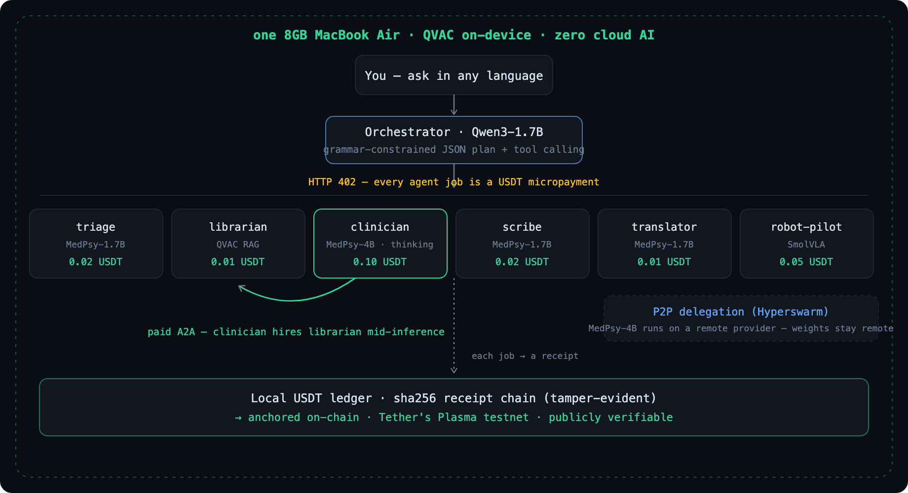

<p align="center">
  
</p>

<p align="center">
  <a href="https://careswarm-agents.vercel.app"><b>▶ Live demo — replay dashboard</b></a>
</p>

**A local-first AI agent economy with a private-healthcare flagship — running entirely on one 8GB MacBook Air.**

Built for [QVAC Hackathon I – Unleash Edge AI](https://dorahacks.io/hackathon/qvac-unleach-edge-ai-i/detail). Tracks: **General Purpose** + **Psy Models**.

A swarm of specialist medical agents plans, reasons, retrieves guidelines, and answers in your language — with **zero cloud AI**. Every piece of inference, embedding, and RAG runs on-device through the [QVAC SDK](https://qvac.tether.io/dev/sdk/). Every agent job is a **USDT micropayment** over HTTP 402. Heavy inference can be **delegated P2P** over the Hyperswarm DHT — and paid for. Health data never leaves the machine.

<p align="center">
  
</p>

### Why edge AI, not cloud

|  | CareSwarm · on-device | Typical cloud medical AI |
|---|---|---|
| **Privacy** | health data never leaves the device | symptoms sent to someone else's servers |
| **Cost** | $0 per query — runs locally | metered per token, forever |
| **Offline** | answers with no connection | needs the cloud to respond |
| **Trust** | every job is a signed receipt, anchored on-chain | opaque, unauditable |

## Why this is interesting

- **Multi-agent orchestration with real tool calling.** The clinician (MedPsy-4B, a thinking model) calls a `search_guidelines` tool *mid-reasoning*; that tool call hires the librarian agent over a **paid** A2A HTTP-402 request. Agents literally buy work from each other.
- **8GB is the feature, not the limit.** A ModelManager runs every model on a hard RAM budget: LRU eviction, idle-TTL unloads, refcounted acquire/release. You can watch models being loaded and evicted live in the dashboard while a workflow runs.
- **An economy, not a pipeline.** Workflow budgets are escrowed (ledger holds), each step settles a micropayment, receipts are sha256-chained (tamper-evident), and session balances can optionally be netted on **Tether's Plasma testnet**.
- **P2P load distribution.** A provider process exposes MedPsy-4B on the Hyperswarm DHT; the clinician buys a session (402) and runs delegated inference — weights stay on the provider, `fallbackToLocal` keeps the demo alive if it dies.
- **Reliability engineering for small models.** The planner uses llama.cpp grammar-constrained JSON (`responseFormat: json_schema`) — a 1.7B model cannot emit a malformed plan — plus a deterministic keyword fallback and a regex emergency pre-check that runs *before* any LLM.

## Run it

Requirements: Node ≥ 22.17, ~8GB free disk for models, macOS/Linux.

```bash
git clone https://github.com/CareSwarm/careswarm && cd careswarm
npm install                  # workspace deps (@qvac/sdk etc.)
npm run download-models      # MedPsy GGUFs from HuggingFace (~3.7GB, resumable)
npm run ingest               # index the medical corpus (QVAC embeddings + RAG)
cd apps/dashboard && npm install && npm run build && cd ../..
./scripts/demo.sh            # agents :3001 + orchestrator :4000 + dashboard :3000
```

Open **http://localhost:3000**, try:

> My father is 62 and gets chest tightness when he climbs stairs; it eases when he rests. What should we do?

Multilingual is built in — ask in another language (or add "answer in Spanish/Vietnamese/…") and the translator agent renders the final note in that language:

> Mi padre tiene dolor en el pecho al subir escaleras. ¿Qué deberíamos hacer?

Or headless:

```bash
curl -X POST localhost:4000/api/orchestrate -H 'Content-Type: application/json' \
  -d '{"prompt":"I have had a mild headache for two days. What should I do?"}'
```

### P2P delegated inference (offload the heavy model to another box)

The clinician (MedPsy-4B) is the only model that strains an 8GB laptop. It can
run on a provider elsewhere — a desktop, a second laptop, or a VPS — reached
over the Hyperswarm DHT and paid per session. Setup for a remote provider is in
[`deploy/`](deploy/README.md).

```bash
# on the provider box (see deploy/README.md): hosts MedPsy-4B, prints its DHT key
# on this laptop:
node scripts/connect-provider.mjs <PROVIDER_PUBKEY>   # pays the session, points the clinician at it
```

`fallbackToLocal: true` keeps every workflow alive when the provider is
unreachable: the clinician finishes locally. By default the demo runs the
clinician locally (with the planner model freed after planning so 4B fits).

Honest notes on what we hit: provider + consumer on **one** machine can't
holepunch to themselves without hairpin NAT (`PEER_CONNECTION_FAILED`), and two
copies of 4B don't fit in 8GB anyway — so this genuinely wants a second box,
which is the point of P2P load distribution. On a remote **ARM64** VPS the
QVAC native inference worker segfaulted (a prebuilt-on-aarch64 issue, tracked);
the session-payment + delegation wiring is in place and `fallbackToLocal`
covers the gap, so the shipped demo runs the clinician on-device.

## Hardware

Everything in the demo video runs on a **MacBook Air (M1, 2020), 8GB RAM, macOS 15** — no eGPU, no cluster, nothing else. See `docs/hardware/` for System Profiler screenshots. Measured on this machine (GPU/Metal backend via QVAC):

| Model | Role | TTFT | Speed |
|---|---|---|---|
| Qwen3-1.7B Q4 | planner | ~540ms | ~34 tok/s |
| MedPsy-1.7B Q4_K_M | triage/scribe/translator | ~570ms | ~47 tok/s |
| MedPsy-4B-Thinking Q4_K_M | clinician | ~420ms | ~19-21 tok/s |

(Exact numbers per run are in the audit log — see below.)

## The audit log

Every model load/unload and every inference appends a JSONL line to `logs/qvac-audit.jsonl`:

```json
{"ts":"…","event":"inference","modelKey":"medpsy_4b","agentId":"clinician","delegated":false,
 "prompt":"…full prompt…","promptTokens":59,"completionTokens":408,"ttftMs":423,
 "tokensPerSecond":19.2,"stopReason":"stop","toolCallNames":["search_guidelines"],
 "paymentReceipt":"rcpt-5c3f1971","process":"agents"}
```

`logs/sample-run.jsonl` is the committed log of the demo-video run. The `/metrics` dashboard page charts the same file live. Payment receipts in the log cross-link to the ledger's hash chain (`/economy` page verifies the chain end-to-end).

## Verify the on-chain anchor

Settlement on Plasma testnet is a **0-value notarization**, not a token transfer. The local USDT ledger is a sha256 hash chain (each receipt commits to the previous via `prev_hash`); a checkpoint tx writes the chain *head* into its calldata as `careswarm:<head>:<digest>`. Anchoring that one hash proves the whole off-chain ledger can't be rewritten — without paying gas per micropayment.

One command checks it end-to-end — it pulls the live tx, decodes the calldata, and walks the receipt chain from that head back to genesis:

```bash
node scripts/verify-onchain.mjs
```

```
on-chain tx   : 0x1ad885a50084da0640f292329c00683d91e7ad98286213aa30ba7e6a96e3713c
calldata      : careswarm:a19703273e…:0410b78b…
anchored head : a19703273e…  →  61 receipts to genesis, links intact ✓
✓ VERIFIED — the on-chain head is the tip of an unbroken sha256 receipt chain.
```

The tx is public on [Plasmascan](https://testnet.plasmascan.to/tx/0x1ad885a50084da0640f292329c00683d91e7ad98286213aa30ba7e6a96e3713c) — it anchors the head of the whole 61-receipt ledger.

## QVAC usage map

| QVAC capability | Where |
|---|---|
| LLM completion (streaming) | every agent, `packages/engine/src/completion.ts` |
| Native tool calling | clinician's `search_guidelines` (paid A2A) |
| Grammar-constrained JSON (`json_schema`) | planner + triage structured output |
| `captureThinking` | clinician (MedPsy-4B thinking traces in the UI) |
| Embeddings | `EmbeddingGemma-300M` via ModelManager |
| RAG workspaces (`ragChunk/ragIngest/ragSearch`) | librarian + corpus ingest |
| P2P delegated inference (`startQVACProvider`, `loadModel({delegate})`) | provider + clinician |
| VLA (SmolVLA-LIBERO) | robot-pilot agent |
| Custom GGUF loading | MedPsy 1.7B/4B from local files |
| Models | MedPsy-1.7B, MedPsy-4B (Psy track), Qwen3-1.7B, EmbeddingGemma, SmolVLA |

No `openai`, `anthropic`, or any cloud AI dependency exists in this repo: `grep -ri "openai\|anthropic" package.json packages services apps/dashboard/package.json` returns nothing. Remote APIs (model downloads at setup, optional Plasma RPC) are declared in [APIS.json](APIS.json).

## Payments (x402)

Agents sit behind an HTTP **402 Payment Required** paywall (`X-Payment-*` headers). The auto-paying client settles on a local SQLite USDT ledger — synchronous, offline, tamper-evident (each receipt is `sha256(prev_hash + row)`). Optional: `POST /api/settle` nets balances into one transaction on **Plasma testnet** (chain 9746) — off by default, demo runs fully offline.

Live proof of the settlement path on Tether's Plasma testnet (the tx calldata anchors the receipt-chain head + a balance digest): [`0x7a07…0afb0`](https://testnet.plasmascan.to/tx/0x7a07094778177363dda884995a626cba40f1be1cbeecd9b828ac45a3dc00afb0) — block 25525135, 26,560 gas.

## Safety

CareSwarm is a hackathon demo, **not a medical device**. A deterministic emergency pre-check runs before any model; every final note ends with a disclaimer; the system is framed as a guideline navigator, never a diagnosis. Prompts are logged in full *by design* (auditability requirement) — don't enter real personal data.

## Prior work

Selected payment/event plumbing was adapted from the author's earlier project agt.finance; the entire AI layer is new for this hackathon, built on QVAC. Full per-file disclosure: [DISCLOSURE.md](DISCLOSURE.md).

## License

Apache-2.0 — see [LICENSE](LICENSE).
